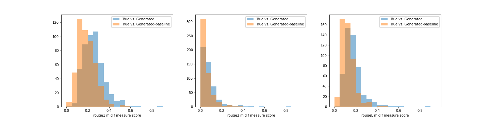

# PaperTweet

In recent years it became common for authors to publicize their scientific papers 
using social media, such as Twitter, usually in the form of public posts. These posts 
vary in length, contain a link to either open-source (e.g. arXiv) or journal reference, 
often involve media, are usually written informally and present a limited amount of 
background and takeaways. 

This repository summarizes my work-in-progress on the questions: (i) what can we learn 
about document understanding from these posts, taken together with their corresponding 
scientific papers? (ii) how can we take advantage of this data, e.g., can we generate
informal summaries to new papers?


## Data mining

The first step we take is mining Twitter data for tweets of the above style. 
Technically, we use the Twitter API v2 with Academic Research access (which is 
considerably superior to basic access, due to the possibility of search the entire 
database rather than the last 7 days).

Querying the right tweets requires some trial-and-error, as well as cleaning. 
We also parse the corresponding HTML arXiv pages, collecting title, authors and abstract. 
We do not yet take advantage of the body of the paper.

The current notebook, that eventually generates a folder data split into months 
(```data/output```), can be found in

```bash
data_pull/scan_twitter.ipynb
```

The data files are currently arranged as a table of `TweetID`, `AuthorID`, 
`AuthorName`, `Tweet` (containing the tweet text and its subsequent thread), 
`arxiv` (a link to arXiv) and `abstract` (of the arXiv paper). 

The data contains about 10,000 examples. By improving the Twitter queries and by
accessing additional paper repositories (e.g., bioRxiv, Nature, etc.), 
I am guessing that the number of examples could increase by a factor of 2-5.


### Required packages

In order to run a Twitter scan: 
tweepy (updated to support Twitter API v2), urlexpander.

### Initial data evaluation

We perform an exploratory data analysis in ```EDA.ipynb```, looking for general statistical 
properties of the data and setting it up in a single file ```data/full_data.csv```.

## Generative model

We attempt to use the above dataset in a straightforward supervised learning approach -- 
taking the abstract as input, generating a "tweet" as output, in a sort-of abstractive summarization task. 
We adopt a pre-trained Transformer: T5-base model 
(though it is easy to shift to larger models, including BART and PEGASUS, with sufficient resources). 
We fine-tune the model using the database generated above.

Since the model has a summarization option built in (with a suitable prompt), we use 
it as a baseline to compare to, i.e., we summarize an abstract and compare to a generated
"tweet". 


### Usage

To train the model on a dataset split into (data_train.csv, data_val.csv and data_test.csv), 
run
```bash
python train.py \
    -i data.csv \
    -o None \
    -m model_path \ 
    -n run_name
```
For inference on a dataset test.csv, both using the fine-tuned model and a pretrained model, run
```bash
python inference.py \
    -i test.csv \
    -o test_pred.csv \
    -m model_path \ 
    -n run_name
```
see ```commands.txt``` for explanation of different flags and further usage.

## Preliminary results
We use a subset of the dataset, called data_mid.csv, with about 5000 examples, 
characterized by the by mid-size Tweet-threads length, between (250, 2500) characters. 
Most of the configuration of the model is defined in config.yml.

One metric that one can use to evaluate the model is the ROUGE F-score. We show it below 
for (i) the generated summaries of the fined-tuned model, and (ii) the generated summaries 
of a pretrained model (called "baseline").

<p>

</p>

The ROUGE-1, ROUGE-2 and ROUGE-L score are better in the fine-tuned model compared to the  
baseline model. More evaluations are shown in evaluate_predictions.ipynb. 

Let us show one example of a generated "tweet" (from my own paper ;-)):
```
Abstract:                    Ultra-diffuse galaxies that contain a large sample of globular clusters (GCs) offer \ 
                             an opportunity to test the predictions of galactic dynamics theory. NGC5846-UDG1 is \ 
                             an excellent example, with a high-quality sample of dozens of GC candidates. We show \
                             that the observed distribution of GCs in NGC5846-UDG1 is suggestive of mass segregation \
                             induced by gravitational dynamical friction. We present simple analytic calculations, \
                             backed by a series of numerical simulations, that naturally explain the observed \
                             present-day pattern of GC masses and radial positions. Subject to some assumptions \
                             on the GC population at birth, the analysis supports the possibility that NGC5846-UDG1 \
                             resides in a massive dark matter halo. This is an example for the use of GC-rich systems \
                             as dynamical (in addition to kinematical) tracers of dark matter.

Generated "Tweets":          paper on the arXiv today! We show that the distribution of globular clusters in \
                             NGC5846-UDG1 is suggestive of mass segregation induced by gravitational dynamical friction.

Generated Baseline Summary:  the distribution of GCs in NGC5846-UDG1 is suggestive of mass segregation. this suggests\
                             mass segregation induced by gravitational dynamical friction.
```
We see that in this particular example, both generated summaries are similar in meaning -- both extracted 
important information from the abstract. However, the generated "Tweet" (i) has a Tweet-like prompt, i.e. 
"paper on the arXiv today!"; (ii) although the generated "Tweet" almost copied a sentence as-is, it decomposed the 
acronym "GCs" (appearing previously in the abstract) into "globular clusters", improving the readability of the "Tweet".

### Discussion
The Twitter data contains a lot of "noise" such as text that is not scientifically relevant to the paper, 
external links that are not explored and media that is not collected. We find that with sufficiently small 
learning rate, the model can learn to summarize the abstracts of the papers, without yielding a lot of noise. 
However, the generated summaries are not particularly informal. Most informality enters in the prompt, e.g., 
"paper on the arXiv today!".

## Relevant literature

I am not aware of any study that attempted to mine the same data (from Twitter or other social media).
Of course the task of text and document summarization has been studied and is well-known.
The task of summarization of papers, possibly for the lay person, has also been studied to some extent. 
An inexhaustive list of papers:

1) Allen AI's scientific TL;DR, [Ref.](https://arxiv.org/abs/2004.15011)
2) Summaries of papers, [Ref.](https://arxiv.org/pdf/2106.00130.pdf)
3) Explaining research in Layman's terms, [Ref.](https://www.aaai.org/AAAI21Papers/AAAI-7740.DangovskiR.pdf)


## Roadmap

This work can be developed in several ways and be connected to other projects. Let us list a few directions.

### - Connection to other work
The data and model could be useful for other projects such as Semantic Scholar (and similar research indexing engines) 
and projects like [ArXiv-Miner](https://arxiv-miner.turing-bot.com/#/README).

### - Mining papers beyond abstract

So far we restricted ourselves to analyzing only the abstract part of the paper. 
This has two reasons:
1) It would take more work from LaTeX-parsing point-of-view to analyze the entire paper.
2) It is generally considered difficult to process an entire paper due to current 
limitation of models. Therefore, limiting ourselves to a small portion of the paper, 
the abstract is a good candidate (although perhaps introduction, summary and conclusions 
might be comparable or better).

To parse arXiv papers, good directions may be [this](https://github.com/alvinwan/texsoup) and [this](https://github.com/valayDave/arxiv-miner/).

### - Mining tweets beyond text

We have only mined the textual part of tweets, ignoring external links, images and videos. These could also be leveraged.

## Acknowledgements
I thank Dana Cohen and Tomer Ronen for useful discussions.

## License

This code is under [MIT](https://opensource.org/licenses/MIT) license. 

If you find the dataset and the analysis useful, please consider citing this repository.

<!-- ## BibTeX entry -->
